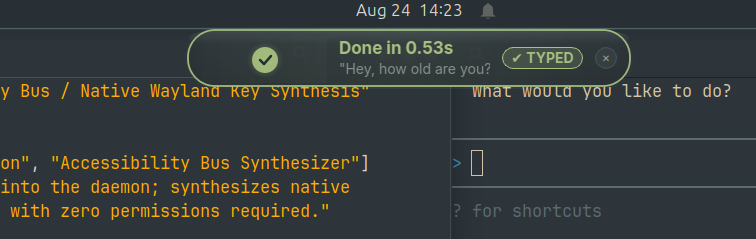
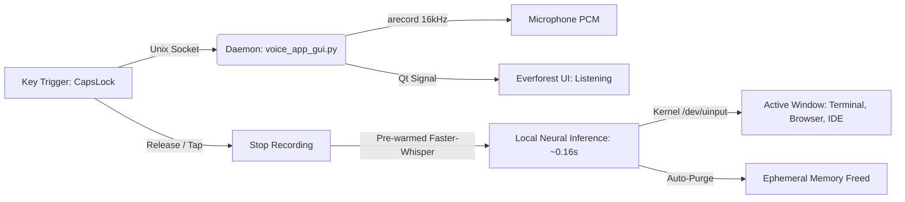

<div align="center">

# Everforest Whisper Dictation Pro

<a href="https://github.com/MrFaraidun/everforest-whisper-dictation">
  
</a>

<br />

<p align="center">
  
  
  
  
</p>

<br />



<br /><br />

A zero-latency, privacy-first voice dictation engine for Linux (**GNOME**, **KDE Plasma**, **Sway**, **Hyprland**). Combines a frosted glass **Everforest Dynamic Island**, pre-warmed **local neural transcription (~0.16s latency)**, and **kernel-level hardware keyboard injection (`ydotool`)** to type directly into whatever window your cursor is focused on.

</div>

---

### // CORE CAPABILITIES

* **Sub-200ms Neural Inference**: Powered by pre-warmed `faster-whisper` (`base.en`, int8 quantization, 8 CPU threads) with zero model reload overhead.
* **Wayland Hardware Injection**: Bypasses Wayland window sandboxing via Linux `/dev/uinput` virtual keyboard (`ydotool` + `wl-clipboard`). Works natively in terminals, editors, and browsers.
* **Frosted Dynamic Island**: Lightweight PyQt5 overlay (`#2d353b`) with mathematical sine equalizers, breathing halo, and live audio duration counters.
* **Zero Focus Theft**: Implements `Qt.WindowDoesNotAcceptFocus` so keyboard cursor focus never leaves the target input field.
* **100% Ephemeral & Private**: Audio is processed strictly in local RAM and immediately purged from `/tmp/` upon transcription.
* **Microsecond Socket IPC**: Background daemon controlled via Unix Domain Socket (`/tmp/whisper_dictation.sock`).

---

### // ARCHITECTURE



---

### // QUICKSTART

#### Automated 1-Command Install:

```bash
git clone https://github.com/MrFaraidun/everforest-whisper-dictation.git
cd everforest-whisper-dictation
./scripts/install.sh
```

The script automatically configures system packages, sets `/dev/uinput` permissions, builds the Python virtual environment, registers the `systemd --user` background daemon, and maps the GNOME global shortcut.

---

### // USAGE

1. Focus any text field or terminal prompt.
2. Tap **`CapsLock`** -> The Everforest Dynamic Island appears (`Listening...`).
3. Speak your phrase naturally.
4. Tap **`CapsLock`** again -> Text is automatically typed into your active window in **~0.16s**.

---

### // CONFIGURATION

#### Keybinding Customization:
To change the shortcut (e.g. to `F8`, `Pause`, or `Ctrl+Space`):

```bash
gsettings set org.gnome.settings-daemon.plugins.media-keys.custom-keybinding:/org/gnome/settings-daemon/plugins/media-keys/custom-keybindings/custom1/ binding "F8"
```

#### Service Management:
```bash
# Check daemon status
systemctl --user status voice-dictation.service

# Restart daemon
systemctl --user restart voice-dictation.service

# Stream logs
journalctl --user -u voice-dictation.service -f
```

---

### // TECH STACK

`Python 3.12` • `Faster-Whisper` • `PyQt5` • `Linux uinput` • `ydotool` • `wl-clipboard` • `systemd`

---

<div align="center">
  <sub>MIT License • Created by <a href="https://github.com/MrFaraidun">Faraidun</a></sub>
</div>
