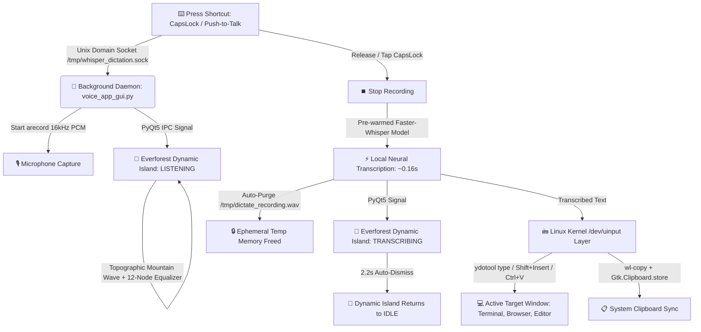

<div align="center">

# 🌲 Everforest Whisper Dictation Pro
### *A bespoke, zero-latency floating Dynamic Island voice dictation tool for Linux Wayland & X11*

[-7fbbb3?style=for-the-badge&logo=linux&logoColor=white)](https://github.com/MrFaraidun/everforest-whisper-dictation)
[-a7c080?style=for-the-badge&logo=openai&logoColor=white)](https://github.com/SYSTRAN/faster-whisper)
[](https://github.com/sainnhe/everforest)
[](LICENSE)

<br />


<br />

**Everforest Whisper Dictation Pro** is an ultra-fast, privacy-first voice-to-text dictation engine built specifically for Linux desktop environments (**GNOME**, **KDE Plasma**, **Sway**, **Hyprland**). It combines an **Everforest Dark Dynamic Island pill**, **local neural transcription (0.16s latency)**, and **kernel-level virtual keyboard injection (`ydotool`)** to type directly into whatever window your cursor is focused on.

</div>

---

## ⚡ Highlights & Key Features

* **🌲 Everforest Dark Aesthetic**: 
  Frosted glass pill (`#2d353b`) with organic 12-node equalizer bars, glowing breathing radial halo, and live topographic waveforms.
* **⚡ Sub-200ms Local Transcription**: 
  Powered by pre-warmed `faster-whisper` (`base.en` running 8 CPU threads with int8 quantization) — transcribes speech in **~0.16 seconds**.
* **🚀 Wayland Native Hardware Typing**: 
  Bypasses Wayland security barriers via Linux kernel `/dev/uinput` virtual keyboard (`ydotool` + `wl-clipboard`). Types into **Terminals**, **VS Code**, **Chrome**, **Slack**, and **Discord** seamlessly.
* **🎯 Zero Focus Stealing**: 
  Built with `Qt.WindowDoesNotAcceptFocus` and X11/Wayland bypass flags — your text cursor never drops out of the active input box while speaking.
* **🔒 100% Private & Ephemeral**: 
  Zero cloud telemetry. Audio is transcribed locally in RAM and auto-purged from `/tmp/` immediately upon completion.
* **⚡ Sub-Millisecond IPC Socket**: 
  Controlled via a Unix Domain Socket (`/tmp/whisper_dictation.sock`) for instant response times (<2ms).

---

## 🎨 Everforest Color Palette & Design Tokens

Designed in harmony with the authentic **Everforest Dark (Medium)** color scheme:

| Color Token | Hex Code | Purpose & Component |
| :--- | :--- | :--- |
| **Forest Night** | `#2d353b` | Floating Dynamic Island Frosted Glass Background |
| **Deep Charcoal** | `#272e33` | Radial Ambient Glow Gradient Endpoint |
| **Forest Moss** | `#a7c080` | Success Badges (`✔ TYPED`), Ready Status, & Top Accent |
| **Sand Amber** | `#dbbc7f` | Real-time Transcribing State & Mid-Tone Waveforms |
| **Terracotta Coral** | `#e67e80` | Live Recording Waveform Pulse & Active Status Indicator |
| **Sage Aqua** | `#7fbbb3` | Secondary Accents & Visualizer Wave Peaks |
| **Warm Forefront** | `#d3c6aa` | Primary Heading Typography |
| **Muted Grey** | `#859289` | Subtitle Micro-copy & Status Labels |

---

## 📐 Architecture & State Machine



### 🏝️ Dynamic Island States

```
1. 🌿 IDLE:
   [ ~~~ (equalizer) ~~~   Whisper Dictation           🌿 READY   ✕ ]

2. 🎙️ LISTENING:
   [ ∿∿∿ (coral pulse) ∿   Listening... Speak now      ● REC 0:03 ✕ ]

3. ⚡ TRANSCRIBING:
   [ ≋≋≋ (amber flow) ≋    Transcribing...             ⚡ AI 0.1s ✕ ]

4. ✔ SUCCESS:
   [ ✔ (moss icon)         "Hey, how old are you?"     ✔ TYPED    ✕ ]
```

---

## 🚀 Installation & Quickstart

### 1-Command Automated Install
Clone this repository and run the automated installer:

```bash
git clone https://github.com/MrFaraidun/everforest-whisper-dictation.git
cd everforest-whisper-dictation
./scripts/install.sh
```

The installer will automatically:
1. Install system requirements (`ydotool`, `wl-clipboard`, `ffmpeg`, `alsa-utils`, `xclip`).
2. Configure kernel virtual keyboard permissions on `/dev/uinput`.
3. Set up the Python virtual environment and pre-warm `faster-whisper`.
4. Register the background systemd user service (`voice-dictation.service`).
5. Bind your GNOME global shortcut to **`CapsLock`**.

---

## ⌨️ How to Use

1. Click your text cursor into **any** application (Terminal, Chrome, VS Code, Discord, Slack, etc.).
2. Tap **`CapsLock`** → The Everforest pill appears: `🎙️ Listening...`.
3. Speak your sentence naturally.
4. Tap **`CapsLock`** again → In **~0.16s**, your text is automatically typed directly into your input!

---

## ⚙️ Configuration & Customization

### Changing the Global Hotkey
You can change the hotkey to any key or combination (e.g. `F8`, `Pause`, `Ctrl+Space`, or `Super+D`):

```bash
# In GNOME:
gsettings set org.gnome.settings-daemon.plugins.media-keys.custom-keybinding:/org/gnome/settings-daemon/plugins/media-keys/custom-keybindings/custom1/ binding "F8"
```

Or configure it graphically in **GNOME Settings** → **Keyboard** → **Custom Shortcuts** → **Whisper Dictation**.

### Using Groq Cloud API (Optional Ultra-Fast Fallback)
If you prefer cloud transcription via Groq instead of running the local model:
```bash
echo 'export GROQ_API_KEY="your_api_key_here"' >> ~/.bashrc
source ~/.bashrc
systemctl --user restart voice-dictation.service
```

### Managing the Background Daemon
```bash
# Check service status
systemctl --user status voice-dictation.service

# Restart service
systemctl --user restart voice-dictation.service

# View real-time logs
journalctl --user -u voice-dictation.service -f
```

---

## 🛠️ Tech Stack & Dependencies

* **Frontend UI**: [PyQt5](https://riverbankcomputing.com/software/pyqt/) with custom `QPainter`, `QPainterPath`, and organic math-driven sine equalizers.
* **Speech-to-Text**: [Faster-Whisper](https://github.com/SYSTRAN/faster-whisper) with `base.en` int8 compute and 8 CPU threads.
* **Wayland Hardware Injection**: Linux Kernel `/dev/uinput` + [`ydotool`](https://github.com/ReimuNotMoe/ydotool) + [`wl-clipboard`](https://github.com/bugaevc/wl-clipboard).
* **Process IPC**: Unix Domain Sockets (`AF_UNIX`).
* **Service Manager**: `systemd --user`.

---

## 📄 License

Distributed under the **MIT License**. See [`LICENSE`](LICENSE) for details.

---

<div align="center">
  Crafted with 🌲 Everforest precision by <a href="https://github.com/MrFaraidun">Faraidun</a>.
</div>
